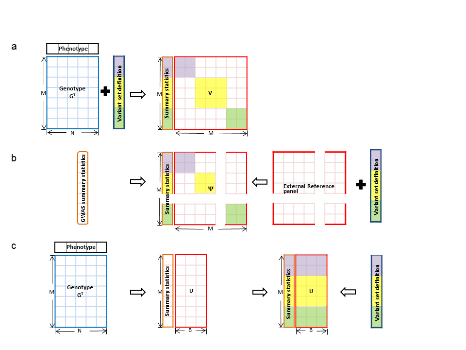

# StocSum (Stochastic Summary statistics for whole genome sequencing studies)
## Description
StocSum is a novel reference-panel-free statistical framework for generating, managing, and analyzing stochastic summary statistics using random vectors. Instead of using external reference panel, StocSum introduces a stochastic summary statistic from study samples to represent the between-variant correlation or LD matrices. It is implemented to various downstream applications, including single-variant tests, conditional association tests, gene-environment interaction tests, variant set tests, as well as meta-analysis and LD score regression tools. 

## StocSum framework


a, Traditional methods calculate the correlation or LD matrix ***V*** from individual-level genotype data. To reduce the computational burden, the full *M* × *M* matrix is usually not computed in practice, but rather replaced by a block-diagonal or banded sparse matrix based on pre-defined variant sets, at the cost of losing the flexibility in testing distant genetic variants jointly. b, The approximate LD matrix ***Ψ*** is obtained from external reference panels when individual-level genotypes are not available, in many genomic summary statistic-based applications. However, variants may be excluded if they do not exist in the reference panel. c, StocSum generates stochastic summary statistics ***U*** from random vectors, which can be used to efficiently look up the covariance among arbitrary variant sets that are not pre-defined. *M*, the number of variants. *N*, the sample size. *B*, the number of random vectors used to construct stochastic summary statistics ***U***.

## Prerequisites
<a href="https://www.r-project.org">R</a>

For optimal computational performance, it is recommended to use an R version configured with the Intel Math Kernel Library (or other fast BLAS/LAPACK libraries). See the <a href="https://software.intel.com/en-us/articles/using-intel-mkl-with-r">instructions</a> on building R with Intel MKL.


## Dependencies
StocSum is an open source project and is freely available for download at https://github.com/NWang-hub/StocSum. StocSum links to R packages <a href="https://CRAN.R-project.org/package=Rcpp">Rcpp</a> and <a href="https://CRAN.R-project.org/package=RcppArmadillo">RcppArmadillo</a>, and also imports R packages <a href="https://CRAN.R-project.org/package=Rcpp">Rcpp</a>, <a href="https://CRAN.R-project.org/package=CompQuadForm">CompQuadForm</a>, <a href="https://CRAN.R-project.org/package=foreach">foreach</a>, <a href="https://CRAN.R-project.org/view=HighPerformanceComputing">parallel</a>, <a href="https://cran.r-project.org/web/packages/Matrix/index.html">Matrix</a>, <a href="https://cran.r-project.org/web/packages/data.table/index.html">data.table</a>, <a href="https://stat.ethz.ch/R-manual/R-devel/library/methods/html/00Index.html">Methods</a>, Bioconductor packages <a href="http://bioconductor.org/packages/release/bioc/html/SeqArray.html">SeqArray</a> and <a href="http://bioconductor.org/packages/release/bioc/html/SeqVarTools.html">SeqVarTools</a>. In addition, StocSum requires <a href="https://CRAN.R-project.org/package=doMC">doMC</a> to run parallel computing (however, <a href="https://CRAN.R-project.org/package=doMC">doMC</a> is not available on Windows and these functions will switch to a single thread). These dependencies should be installed before installing StocSum.


## Installing
```
install.packages(c("devtools", "RcppArmadillo", "CompQuadForm", "doMC", "foreach", "Matrix", "data.table", "GMMAT", "BiocManager", "testthat"), repos="https://cran.r-project.org/")
BiocManager::install(c("SeqArray", "SeqVarTools"))
devtools::install_github(repo="https://github.com/NWang-hub/StocSum")

Note: Installing the StocSum package typically takes less than 20 seconds on a MacBook Pro with 8GB of memory and 8 cores, provided that all required dependency packages are already installed. Running the test examples included in the package take less than 60 seconds.  
```
## Usage
Please see the <a href="vignettes/StocSum_tutorial.pdf">**StocSum** tutorial</a> for an example of analyzing sequencing data using StocSum.

## Version
The current version is 0.1.0 (Feb 24, 2023).

## Citation
If you use **StocSum** for your work, please cite:

Nannan Wang, Bing Yu, Goo Jun, Qibin Qi, Ramon A. Durazo-Arvizu, Sara Lindstrom, Alanna C. Morrison, Robert C. Kaplan, Eric Boerwinkle, Han Chen. (2023). StocSum: stochastic summary statistics for whole genome sequencing studies. bioRxiv 2023.04.06.535886. doi: https://doi.org/10.1101/2023.04.06.535886.

## License
This software is licensed under GPL (>= 3).

## Contact
Please refer to the R help document of StocSum for specific questions about each function. For comments, suggestions, bug reports and questions, please contact Han Chen (Han.Chen.2 AT uth.tmc.edu) or Nannan Wang (nannan.wang AT uth.tmc.edu). For bug reports, please include an example to reproduce the problem without having to access your confidential data.
